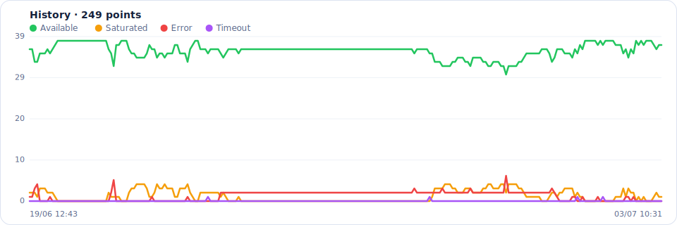
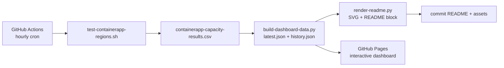

# Azure Container Apps – availability per region

Tests **every hour** the ability to create an *Azure Container App
Environment* in each Azure region, in order to spot those affected by the
AKS capacity error (`AKSCapacityHeavyUsage` /
`ManagedEnvironmentCapacityHeavyUsageError`).

The test runs on GitHub Actions, the result is published below (updated
automatically) and on an interactive dashboard via GitHub Pages.

<!-- DASHBOARD:START -->
## 🌍 Azure Container Apps availability

> Capacity to create a Container App Environment per region · automatically updated on **2026-07-16 15:26 UTC**.

    

<picture>
  <source media="(prefers-color-scheme: dark)" srcset="assets/history-dark.svg" />
  
</picture>

### Regions to watch

| Status | Region | Detail |
| :--- | :--- | :--- |
| 🟠 Saturated | `centralus` | capacity exhausted (AKSCapacityHeavyUsage) |
| 🟠 Saturated | `eastus` | capacity exhausted (AKSCapacityHeavyUsage) |
| 🟠 Saturated | `swedencentral` | capacity exhausted (AKSCapacityHeavyUsage) |
| 🔴 Error | `australiasoutheast` | / Running .. \| Running .. \ Running .. - Running .. / Running .. \| Running .. \ Running .. - Running .. / Running .. \| Running .. \ Running .. - Running .. / Running .. \| Running .. \ Running .. - Ru |
| 🔴 Error | `eastasia` | / Running .. \| Running .. \ Running .. - Running .. / Running .. \| Running .. \ Running .. - Running .. / Running .. \| Running .. \ Running .. - Running .. / Running .. \| Running .. \ Running .. - Ru |
| 🔴 Error | `francecentral` | / Running .. \| Running .. \ Running .. - Running .. / Running .. \| Running .. \ Running .. - Running .. / Running .. \| Running .. \ Running .. - Running .. / Running .. \| Running .. \ Running .. - Ru |
| 🔴 Error | `germanywestcentral` | / Running .. \| Running .. \ Running .. - Running .. / Running .. \| Running .. \ Running .. - Running .. / Running .. \| Running .. \ Running .. - Running .. / Running .. \| Running .. \ Running .. - Ru |
| 🔴 Error | `indonesiacentral` | / Running .. \| Running .. \ Running .. - Running .. / Running .. \| Running .. \ Running .. - Running .. / Running .. \| Running .. \ Running .. - Running .. / Running .. \| Running .. \ Running .. - Ru |
| 🔴 Error | `italynorth` | / Running .. \| Running .. \ Running .. - Running .. / Running .. \| Running .. \ Running .. - Running .. / Running .. \| Running .. \ Running .. - Running .. / Running .. \| Running ..ERROR: The command |
| 🔴 Error | `japaneast` | / Running .. \| Running .. \ Running .. - Running .. / Running .. \| Running .. \ Running .. - Running .. / Running .. \| Running ..ERROR: The command failed with an unexpected error. Here is the traceb |
| 🔴 Error | `japanwest` | / Running .. \| Running .. \ Running .. - Running .. / Running .. \| Running .. \ Running .. - Running .. / Running .. \| Running .. \ Running .. - Running .. / Running .. \| Running .. \ Running .. - Ru |
| 🔴 Error | `jioindiawest` | / Running .. \| Running .. \ Running .. - Running .. / Running .. \| Running .. \ Running ..ERROR: The command failed with an unexpected error. Here is the traceback: ERROR: ('Connection aborted.', Con |
| 🔴 Error | `koreacentral` | / Running .. \| Running .. \ Running ..ERROR: The command failed with an unexpected error. Here is the traceback: ERROR: ('Connection aborted.', ConnectionResetError(104, 'Connection reset by peer')) |
| 🔴 Error | `malaysiawest` | / Running ..ERROR: The command failed with an unexpected error. Here is the traceback: ERROR: ('Connection aborted.', ConnectionResetError(104, 'Connection reset by peer')) Traceback (most recent cal |
| 🔴 Error | `northcentralus` | / Running .. \| Running .. \ Running .. - Running .. / Running .. \| Running .. \ Running .. - Running .. / Running .. \| Running .. \ Running .. - Running .. / Running .. \| Running .. \ Running .. - Ru |
| 🔴 Error | `northeurope` | / Running .. \| Running .. \ Running .. - Running .. / Running .. \| Running .. \ Running .. - Running .. / Running .. \| Running .. \ Running .. - Running .. / Running .. \| Running .. \ Running .. - Ru |
| 🔴 Error | `norwayeast` | / Running .. \| Running .. \ Running .. - Running .. / Running .. \| Running .. \ Running .. - Running .. / Running .. \| Running .. \ Running .. - Running .. / Running .. \| Running .. \ Running .. - Ru |
| 🔴 Error | `polandcentral` | / Running .. \| Running .. \ Running .. - Running ..ERROR: The command failed with an unexpected error. Here is the traceback: ERROR: ('Connection aborted.', ConnectionResetError(104, 'Connection rese |
| 🔴 Error | `southafricanorth` | / Running .. \| Running .. \ Running .. - Running .. / Running .. \| Running .. \ Running .. - Running .. / Running .. \| Running .. \ Running .. - Running .. / Running .. \| Running .. \ Running .. - Ru |
| 🔴 Error | `southcentralus` | / Running .. \| Running ..ERROR: The command failed with an unexpected error. Here is the traceback: ERROR: ('Connection aborted.', ConnectionResetError(104, 'Connection reset by peer')) Traceback (mo |
| 🔴 Error | `southindia` | ERROR: The command failed with an unexpected error. Here is the traceback: ERROR: ('Connection aborted.', ConnectionResetError(104, 'Connection reset by peer')) Traceback (most recent call last): File |
| 🔴 Error | `spaincentral` | / Running .. \| Running .. \ Running ..ERROR: The command failed with an unexpected error. Here is the traceback: ERROR: ('Connection aborted.', ConnectionResetError(104, 'Connection reset by peer')) |
| 🔴 Error | `uksouth` | / Running .. \| Running .. \ Running .. - Running .. / Running .. \| Running .. \ Running .. - Running .. / Running .. \| Running .. \ Running .. - Running .. / Running .. \| Running .. \ Running .. - Ru |
| 🔴 Error | `westcentralus` | / Running .. \| Running .. \ Running .. - Running .. / Running .. \| Running .. \ Running .. - Running .. / Running .. \| Running ..ERROR: The command failed with an unexpected error. Here is the traceb |
| 🔴 Error | `westeurope` | / Running .. \| Running .. \ Running .. - Running .. / Running .. \| Running .. \ Running ..ERROR: The command failed with an unexpected error. Here is the traceback: ERROR: ('Connection aborted.', Con |
| 🔴 Error | `westus` | / Running .. \| Running .. \ Running .. - Running .. / Running .. \| Running .. \ Running .. - Running ..ERROR: The command failed with an unexpected error. Here is the traceback: ERROR: ('Connection a |
| 🔴 Error | `westus2` | ERROR: The command failed with an unexpected error. Here is the traceback: ERROR: ('Connection aborted.', ConnectionResetError(104, 'Connection reset by peer')) Traceback (most recent call last): File |
| 🔴 Error | `westus3` | ERROR: The command failed with an unexpected error. Here is the traceback: ERROR: ('Connection aborted.', ConnectionResetError(104, 'Connection reset by peer')) Traceback (most recent call last): File |

<details>
<summary>🟢 10 available regions</summary>

`australiaeast`, `brazilsouth`, `canadacentral`, `canadaeast`, `centralindia`, `eastus2`, `southeastasia`, `switzerlandnorth`, `uaenorth`, `ukwest`

</details>

<sub>Updated hourly via GitHub Actions · <a href="#interactive-dashboard">interactive version</a> on GitHub Pages.</sub>
<!-- DASHBOARD:END -->

## How it works



For each region: creates a resource group and a test Container App
Environment (Consumption, no logs), then **deletes it immediately**.
Each region is classified `OK`, `CAPACITY`, `ERROR` or `TIMEOUT`.

## The test script

```bash
# All supported regions (automatic discovery)
./test-containerapp-regions.sh

# A specific list
./test-containerapp-regions.sh westeurope northeurope

# 10 regions in parallel, without deletion (debug)
CONCURRENCY=10 KEEP=true ./test-containerapp-regions.sh

# Clean up leftover test resource groups
./test-containerapp-regions.sh --cleanup
```

Requirements: Azure CLI ≥ 2.49 and `az login`.

## Interactive dashboard

The interactive version (filters, search, history) is published on
**GitHub Pages** on each run. Enable it in *Settings → Pages →
Source = GitHub Actions*; the URL then appears in the workflow summary.

## Setting up the automation

1. **GitHub Pages**: *Settings → Pages → Source = "GitHub Actions"*.
2. **Azure connection (service principal)**: create a service principal with a
   client secret and set the secrets `AZURE_CLIENT_ID`, `AZURE_CLIENT_SECRET`,
   `AZURE_TENANT_ID` and `AZURE_SUBSCRIPTION_ID`. The identity must be
   *Contributor* on the test subscription.
3. The [`availability.yml`](.github/workflows/availability.yml) workflow then
   runs every hour (and can be triggered manually via *Run workflow*).

> The README dashboard block and the `assets/history-*.svg` images are
> regenerated and committed automatically on each run.

## Structure

| File | Role |
| :--- | :--- |
| [`test-containerapp-regions.sh`](test-containerapp-regions.sh) | Capacity test per region → CSV |
| [`scripts/build-dashboard-data.py`](scripts/build-dashboard-data.py) | CSV → `latest.json` + `history.json` |
| [`scripts/render-readme.py`](scripts/render-readme.py) | JSON → SVG + README block |
| [`dashboard/`](dashboard/) | Interactive dashboard (GitHub Pages) |
| [`.github/workflows/availability.yml`](.github/workflows/availability.yml) | Hourly orchestration |
